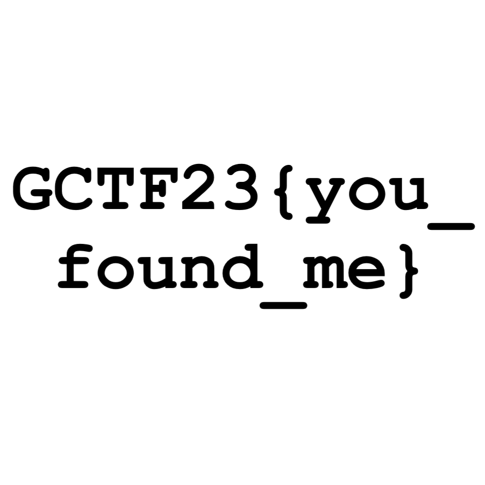

# lost_perspective

## Summary

- Steganography with file type obfuscation
- Steganography with embedded files in file

## Files

- [you_cant_see_me.mp4](you_cant_see_me.mp4)

## Steps

1. Run [foremost](https://www.kali.org/tools/foremost/) on the file
2. Find the PNG file
    
