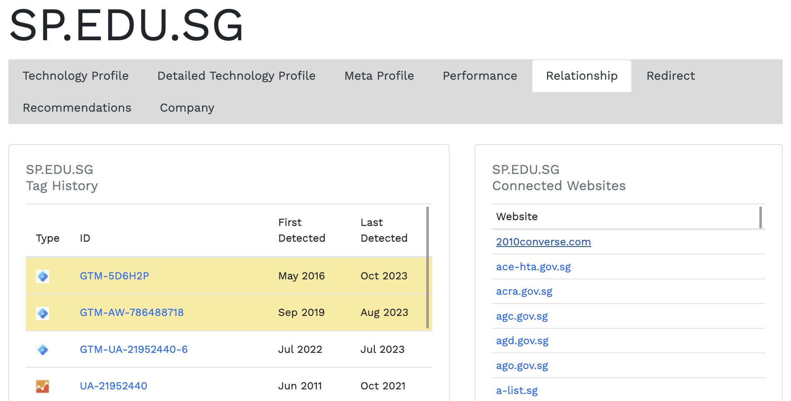

# Similarities

## Summary

- OSINT with website tags history

## Files

N.A.

## Steps

Nearly impossible without the hint lol

Requires to signing in to BuiltWith, create a throwaway account if needed

1. On [BuiltWith](https://builtwith.com/), lookup `sp.edu.sg`
2. Go to the Relationship tab and under Tag History, identify tags that are also used by the website `2010converse.com`
    
3. The flag is the tag that was detected from Sep 2019 to Aug 2023